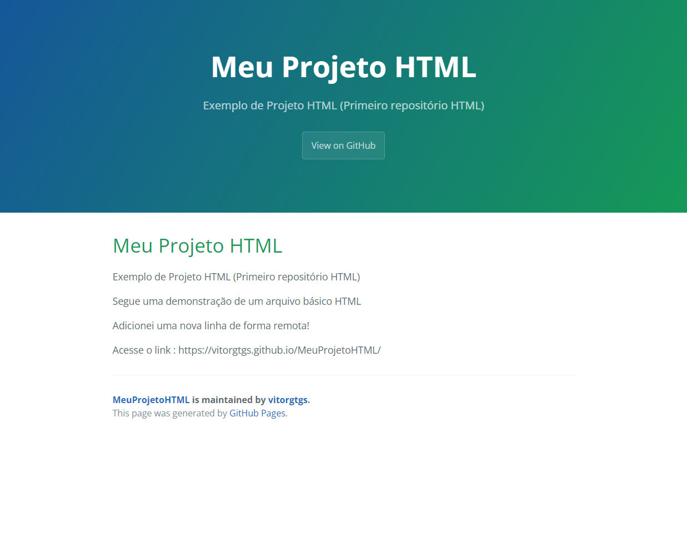

# Meu Projeto HTML
 Exemplo de Projeto HTML (Primeiro repositório HTML)
 
Segue uma demonstração de um arquivo básico HTML.

Adicionei uma nova linha de forma remota!

Entendendo um pouco mais sobre tags (Elementos) :
- &lt;p> (Parágrafo).
- &lt;h1> (Define o nível mais alto ou o título mais importante no documento HTML).
- &lt;hr> (Quebra de linha).

[Clique aqui para acessar!](https://vitorgtgs.github.io/MeuProjetoHTML/)

## ⚙ Tecnologias

- HTML
- Git e GitHub